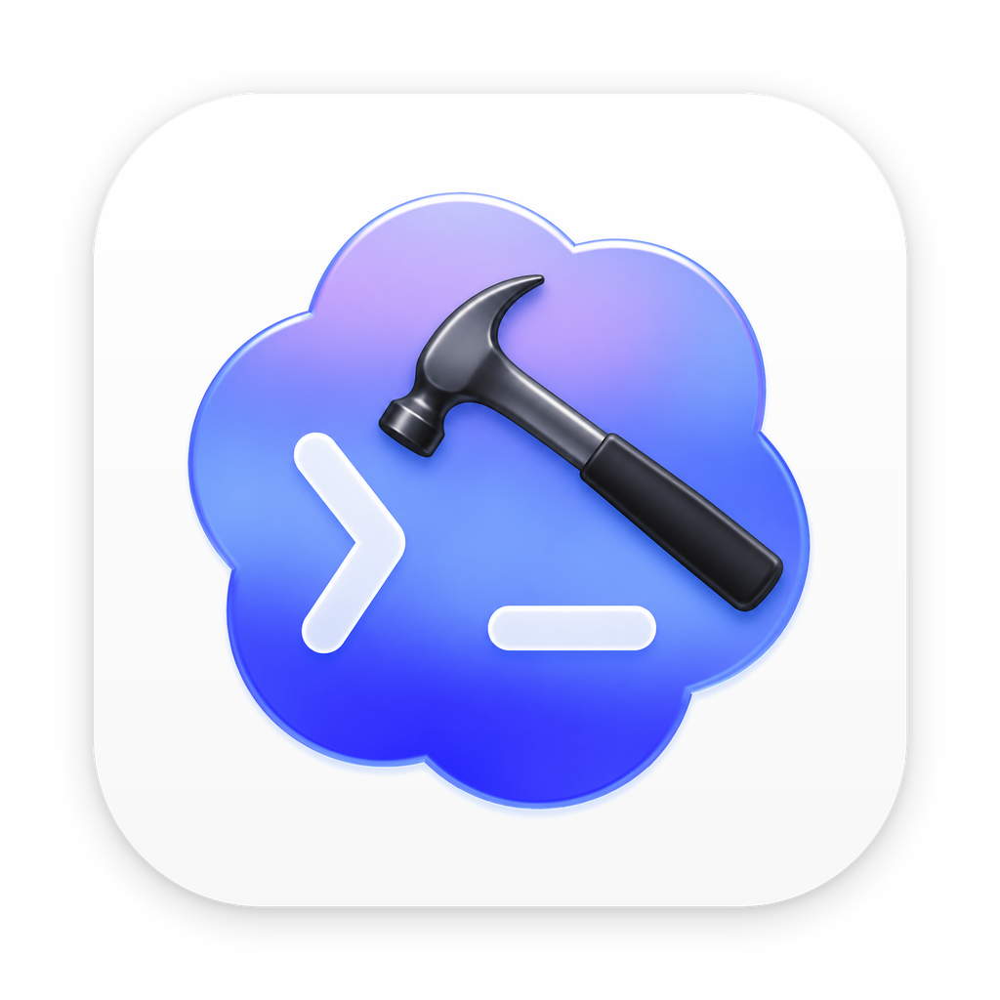
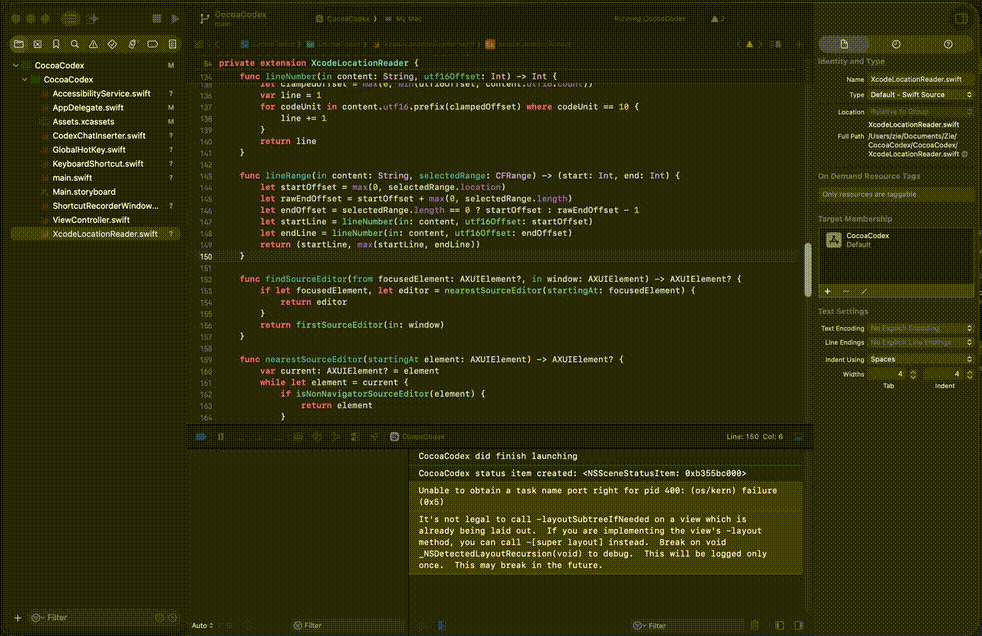

# CocoaCodex

<p align="center">
  
</p>

CocoaCodex is a tiny macOS menu bar app that sends your current Xcode selection to Codex.

Press a global shortcut in Xcode, and CocoaCodex copies a Markdown link to the selected file and line range, then inserts it into the current Codex chat input.



## What It Does

- Reads the current file path and selected line range from Xcode.
- Generates a Markdown link like:

```markdown
[XcodeLocationReader.swift (line 25-28)](/Users/you/Project/XcodeLocationReader.swift:25-28)
```

- Brings Codex to the foreground.
- Pastes the generated reference into the current Codex chat.
- Runs as a lightweight menu bar app.

## Why

When asking Codex about code, the most useful context is often:

- the exact file
- the exact selected line or line range
- a link-like format that is easy to read and copy

CocoaCodex makes that one shortcut instead of a manual copy/paste ritual.

## Requirements

- macOS
- Xcode
- Codex app
- Accessibility permission for CocoaCodex

CocoaCodex uses macOS Accessibility APIs to read Xcode UI state and paste into Codex. It does not require an Xcode Source Editor Extension.

## Usage

1. Launch CocoaCodex.
2. Grant Accessibility permission when prompted.
3. Open Xcode and select code.
4. Press the shortcut.

Default shortcut:

```text
Cmd+L
```

To change the shortcut, click the menu bar icon, then click `Shortcut: Cmd+L`.

## Menu

The menu is intentionally minimal:

```text
Accessibility: Granted
Shortcut: Cmd+L
Quit
```

## How It Works

CocoaCodex uses:

- `AXUIElement` to inspect Xcode's focused source editor.
- `AXDocument` to resolve the current file path.
- `AXSelectedTextRange` and editor text content to calculate line ranges.
- Carbon global hot keys for the shortcut.
- macOS pasteboard and synthetic paste events to insert text into Codex.

For multi-line selections, CocoaCodex emits a range:

```markdown
[File.swift (line 10-14)](/path/to/File.swift:10-14)
```

For a cursor position or single-line selection, it emits one line:

```markdown
[File.swift (line 10)](/path/to/File.swift:10)
```

## Build

Open the project in Xcode:

```bash
open CocoaCodex.xcodeproj
```

Then build and run the `CocoaCodex` scheme.

You can also build from the command line:

```bash
xcodebuild -project CocoaCodex.xcodeproj -scheme CocoaCodex -configuration Debug build
```

The debug app is usually produced under:

```text
~/Library/Developer/Xcode/DerivedData/.../Build/Products/Debug/CocoaCodex.app
```

## Privacy

CocoaCodex does not send data to any server. It only reads local Accessibility information from Xcode and writes text to the local pasteboard / Codex input.

## License

MIT
